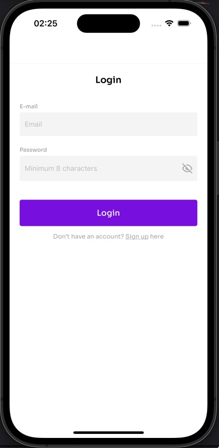
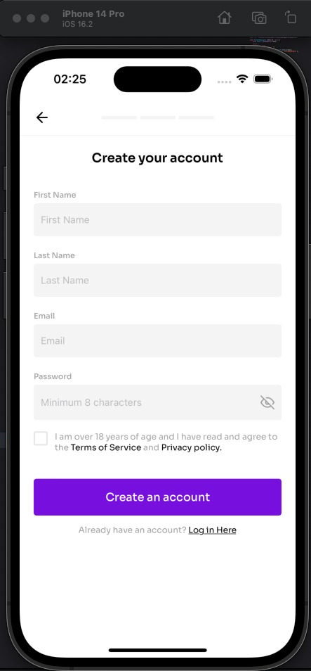
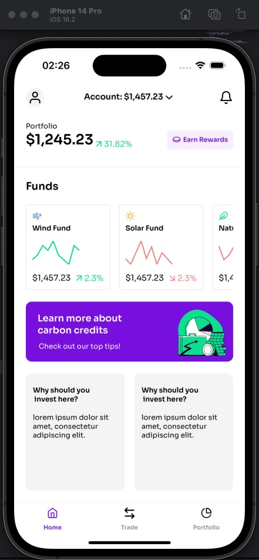
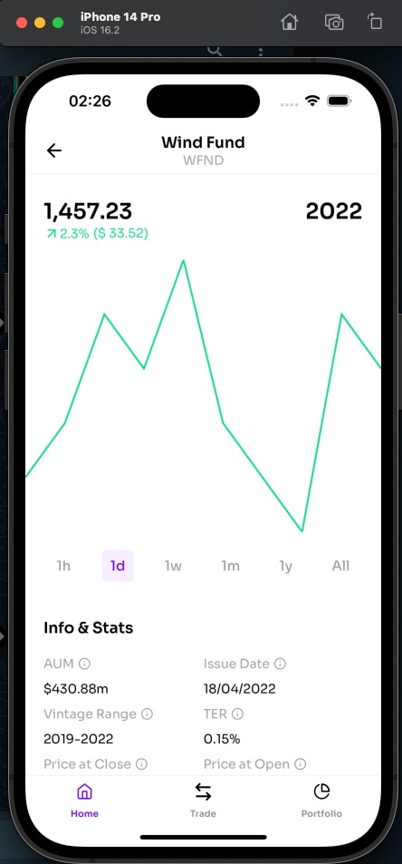

<h1 align="center">
  Renewable energy
</h1>

  

  
  
  

  

  

  <a href="#rocket-technologies">Technologies</a>&nbsp;&nbsp;&nbsp;|&nbsp;&nbsp;&nbsp;
  <a href="#-projects-description">Project's Description</a>&nbsp;&nbsp;&nbsp;|&nbsp;&nbsp;&nbsp;
  <a href="#memo-license">License</a>

 

  
  
  
  

 

## :rocket: Technologies

This project was developed mainly with the following technologies

- [React Native](https://facebook.github.io/react-native/)
- [Typescript](https://www.typescriptlang.org/)
- [Redux Toolkit](https://redux-toolkit.js.org/)
- [Styled Components](https://styled-components.com/)
- [Victory Charts](https://formidable.com/open-source/victory/)
- [Expo](https://expo.dev/)

## 💻 Project's Description

- A mock app to track multiple funds and its data

## 🎮 Start

- Step 1: Run command `npm install` to install project's dependencies.

- Step 2: Run command `npm run android or npm run ios` to install the application on your emulator;

Obs: In case you don't have your environment configured to run an emulator [click here](https://reactnative.dev/docs/environment-setup) and follow the steps on React Native's documentation.

## :memo: License

This project is under MIT license. Check the license file [LICENSE](LICENSE) for more details.

---

Developed by Arthur Dionízio
